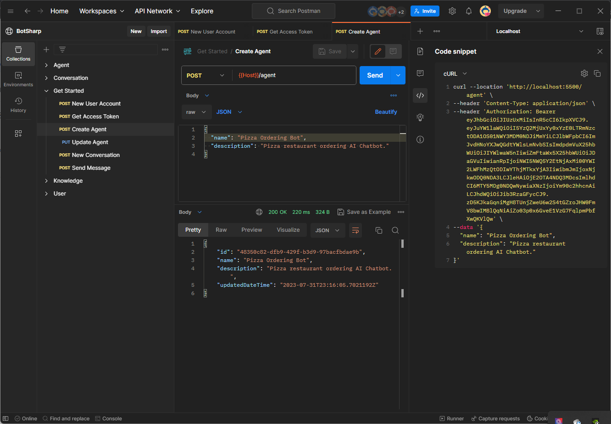
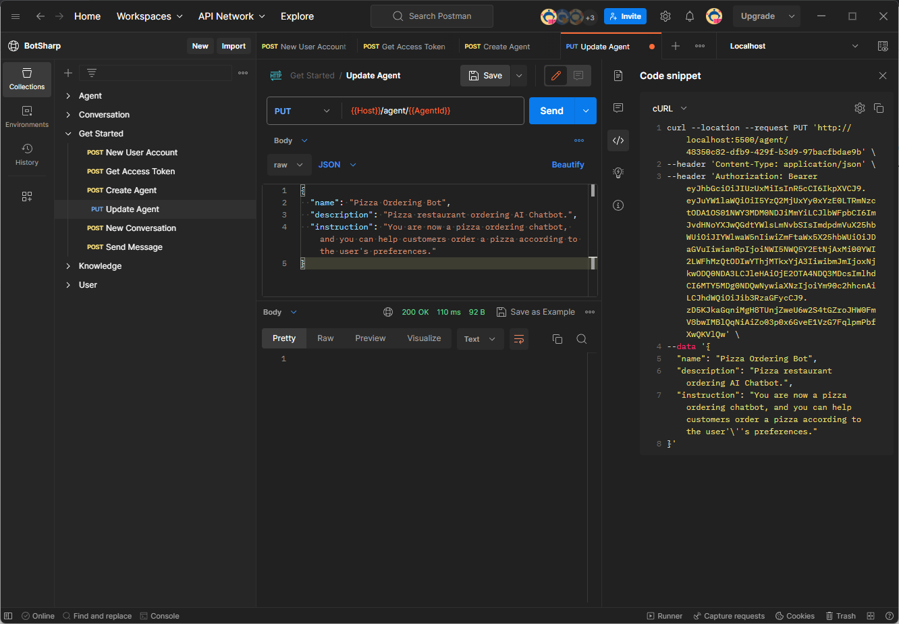

# 智能体介绍

智能体帮助您将用户句子（非结构化数据）处理为结构化数据，以便您可以使用这些数据返回适当的响应。

智能体是包含提示词和功能 Json Schema 定义、少量示例和知识库数据的集合。您可以创建多个不同的智能体以在特定领域执行特定操作。BotSharp 内置了对智能体的维护，包括创建、更新和删除、导入和导出。智能体分为 `任务智能体`、`路由（非任务）智能体`、`评估智能体` 和 `静态智能体`。业务领域智能体属于任务智能体，路由器属于非任务智能体，静态智能体没有与外部环境交互的能力。

## 我的智能体
创建平台账户后，您可以开始进入创建智能体的步骤。

### 智能体创建
假设我们需要编写一个披萨餐厅订单 AI 机器人。首先，指定名称和描述，然后调用 [智能体创建](https://www.postman.com/orange-flare-634868/workspace/botsharp/request/1346299-dc57eddb-a3eb-41f1-9c6c-ac65f9d8d510) API 创建一个新机器人，系统将返回一个内部使用的智能体 ID。此 ID 需要在后续交互中使用。



### 智能体指令
BotSharp 使用最新的大语言模型进行自然语言理解，可以与 OpenAI 的 ChatGPT 交互，也支持最广泛使用的开源大语言模型 [LLaMA](https://ai.meta.com/blog/large-language-model-llama-meta-ai/) 及其微调模型。在此示例中，我们使用 [Azure OpenAI](https://azure.microsoft.com/en-us/products/ai-services/openai-service) 作为 LLM 引擎。

```json
"LlmProviders": [
    {
        "Provider": "azure-openai",
        "Models": [{
            "Name": "gpt-35-turbo",
            "ApiKey": "",
            "Endpoint": "https://gpt-35-turbo.openai.azure.com/",
            "Type": "chat",
            "PromptCost": 0.0015,
            "CompletionCost": 0.002
        }]
    }
]
```

如果您使用安装包运行，请确保已安装 [BotSharp.Plugin.AzureOpenAI](https://www.nuget.org/packages/BotSharp.Plugin.AzureOpenAI) 插件包。

现在我们可以通过 [智能体更新](https://www.postman.com/orange-flare-634868/workspace/botsharp/request/1346299-01c38741-987b-42af-850d-1b1e21b506df) API 更新聊天机器人的提示。



更新成功后，机器人将拥有系统提示，后续对话将基于系统提示的背景知识与用户互动。到目前为止，智能体的创建已经完成，但真正的对话尚未开始。接下来将继续介绍最后一步，[智能体对话](../conversation/intro.md) 部分。