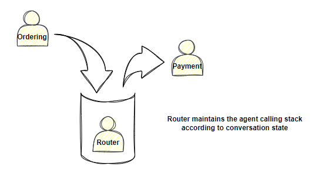

# 路由器

本节将详细解释路由器的使用。路由器有一个专门的配置节点用于自定义。

```json
"Router": {
    "RouterId": "",
    "Provider": "azure-openai",
    "Model": "gpt-4"
}
```

## 路由器如何工作

### 如何将智能体注册到路由器？

当您添加一个新的智能体时，路由器可以自动读取智能体的配置，但为了让路由器将请求分配给新的智能体，您必须将 `AllowRouting` 属性设置为 `True`。有关如何使用路由器的更多信息，请参阅智能体/路由器章节。

## 路由能力扩展

如果您需要扩展路由器的功能，我们只需要添加相应的 **路由处理程序**。

### 如何添加自定义处理程序？

```csharp
public class TransferToCsrRoutingHandler : IRoutingHandler
{
        public string Name => "order_payment";

        public string Description => "pay the order.";

        private readonly RoutingSettings _settings;

        public TransferToCsrRoutingHandler(RoutingSettings settings) 
        {
                _settings = settings;
        }

        public async Task<RoleDialogModel> Handle(IRoutingService routing, FunctionCallFromLlm inst)
        {
                var result = new RoleDialogModel(AgentRole.User, "I'm connecting the payment gateway, wait a moment please.")
                {
                        CurrentAgentId = _settings.RouterId,
                        FunctionName = inst.Function
                };
                return result;
        }
}
```

## 路由 - 重定向

路由器将维护一个智能体调用堆栈，并根据对话状态和重定向配置自动设置当前活动的智能体。



您可以根据业务需求配置重定向规则。

```json
{
        "routingRules": [
                {
                        "field": "order_number",
                        "required": true,
                        "description": "pizza order number",
                        "redirectTo": "c2b57a74-ae4e-4c81-b3ad-9ac5bff982bd"
                }
        ]
}
```
