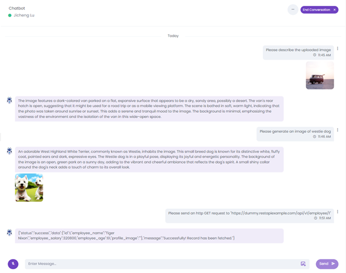
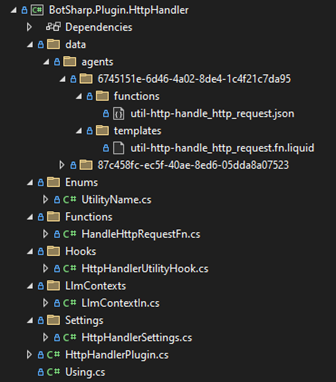
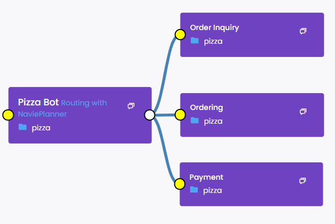
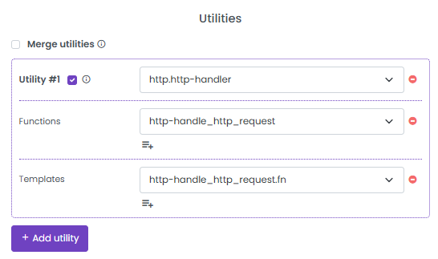
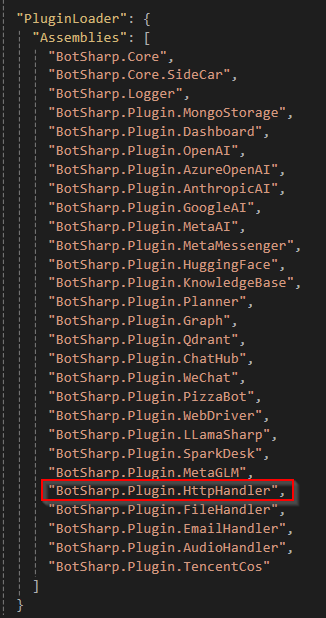
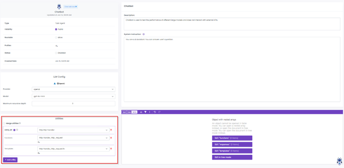
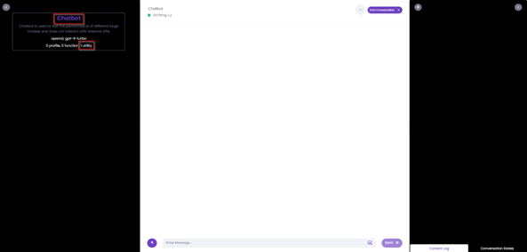
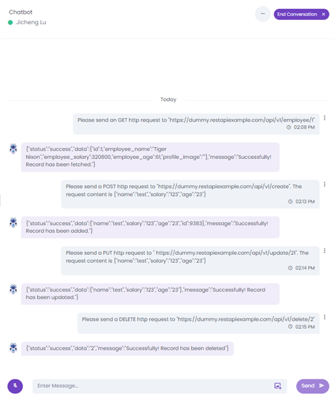

# 智能体实用工具

## 介绍
本文档旨在介绍智能体实用工具的概念，并提供在 AI 项目 “BotSharp” 中添加自定义智能体实用工具的说明。我们将首先在[第 2 节](#agent-utility)解释智能体实用工具的机制。然后，我们将在[第 3 节](#agent-utility-setup)和[第 4 节](#agent-utility-integration)中分别说明自定义智能体实用工具的设置和集成。最后在[第 5 节](#use-case-demo)中展示一个用例，并以简短的总结结束本文档。

## 智能体实用工具
智能体实用工具是一种独特的功能，可以集成到智能体中以增强其能力。其核心原理是它可以在对话过程中动态且无缝地添加额外的提示和任务导向的功能（或工具），而不会干扰智能体的主要目的。换句话说，智能体实用工具可以根据对话的上下文执行额外的任务。智能体实用工具的典型例子包括读取图像/PDF、生成图像和发送 HTTP 请求。[图 2.1.1](#agent-utility-example) 展示了这些实用工具的一个例子。在这个例子中，“Chatbot” 是一个简单的回答用户问题的智能体，而这些实用工具扩展了其解释图像内容、生成请求图像和发送特定 HTTP 请求的能力。


<br />

## 智能体实用工具设置
在本节中，我们概述了设置自定义智能体实用工具的步骤。我们从基本代码结构开始，然后添加必要的实用工具数据，如提示和功能。实用工具钩子用于将实用工具合并到智能体中。最后，我们简要概述实用工具的实现。

### 基本代码结构
典型智能体实用工具的基本代码结构包括提示/功能数据、钩子和功能实现。我们可以在不同的项目中添加特定的实用工具提示和功能。请注意，智能体 **“6745151e-6d46-4a02-8de4-1c4f21c7da95”** 被视为专用的实用工具助手，每个提示和功能都可以选择性地用作实用工具。[图 3.1.1](#agent-utility-code-structure) 展示了提示、功能、钩子和 HTTP 实用工具实现的结构。


<br />

### 实用工具数据
对于典型的智能体实用工具，至少需要添加一个提示和一个功能。实用工具名称的格式为 **“[plugin name].[utility name]”**，例如 “http.http-handler”。提示添加在 “templates” 文件夹下，推荐名称为 **“util-[plugin name]-[function name].fn.liquid”**，而功能添加在 “functions” 文件夹下，推荐名称为 **“util-[plugin name]-[function name].json”**。编译项目后，我们可以在以下位置找到聚合的实用工具助手文件夹：**“\BotSharp\src\WebStarter\bin\Debug\net8.0\data\agents\6745151e-6d46-4a02-8de4-1c4f21c7da95”**。

### 实用工具钩子
实用工具钩子用于将智能体实用工具连接到智能体系统。下面的代码片段展示了 HTTP 实用工具钩子的实现，我们在其中定义了实用工具名称、提示和功能。请注意，每个实用工具可以跨不同的智能体使用。

```csharp
public class HttpHandlerPlugin : IBotSharpPlugin
{
    public string Id => "2c1eb1c4-16e5-4c65-8ee4-032324c26b81";
    public string Name => "HTTP Handler";
    public string Description => "Empower agent to handle HTTP request in RESTful API or GraphQL";
    public string IconUrl => "https://lirp.cdn-website.com/6f8d6d8a/dms3rep/multi/opt/API_Icon-640w.png";
    public string[] AgentIds => new[] { "87c458fc-ec5f-40ae-8ed6-05dda8a07523" };

    public void RegisterDI(IServiceCollection services, IConfiguration config)
    {
        services.AddScoped(provider =>
        {
            var settingService = provider.GetRequiredService<ISettingService>();
            return settingService.Bind<HttpHandlerSettings>("HttpHandler");
        });

        services.AddScoped<IAgentUtilityHook, HttpHandlerUtilityHook>();
    }
}
### 智能体钩子实现
智能体钩子用于在对话过程中附加实用工具提示和功能。**请注意，实用工具数据仅允许包含在对话上下文中**。实用工具机制在 **“OnAgentUtilityLoaded”** 钩子中实现，并在加载任何智能体时调用。

```csharp
public async Task<Agent> LoadAgent(string id)
{
    if (string.IsNullOrEmpty(id) || id == Guid.Empty.ToString())
    {
        return null;
    }

    var hooks = _services.GetServices<IAgentHook>();

    // Before agent is loaded.
    foreach (var hook in hooks)
    {
        if (!string.IsNullOrEmpty(hook.SelfId) && hook.SelfId != id)
        {
            continue;
        }

        hook.OnAgentLoading(ref id);
    }

    var agent = await GetAgent(id);
    if (agent == null)
    {
        return null;
    }

    await InheritAgent(agent);
    OverrideInstructionByChannel(agent);
    AddOrUpdateParameters(agent);

    // Populate state into dictionary
    agent.TemplateDict = new Dictionary<string, object>();
    PopulateState(agent.TemplateDict);

    // After agent is loaded
    foreach (var hook in hooks)
    {
        if (!string.IsNullOrEmpty(hook.SelfId) && hook.SelfId != id)
        {
            continue;
        }

        hook.SetAget(agent);

        if (!string.IsNullOrEmpty(agent.Instruction))
        {
            hook.OnInstructionLoaded(agent.Instruction, agent.TemplateDict);
        }

        if (agent.Functions != null)
        {
            hook.OnFunctionsLoaded(agent.Functions);
        }

        if (agent.Samples != null)
        {
            hook.OnSamplesLoaded(agent.Samples);
        }

        hook.OnAgentUtilityLoaded(agent);
        hook.OnAgentLoaded(agent);
    }

    _logger.LogInformation($"Loaded agent {agent}.");

    return agent;
}
```

### 实用工具功能实现
这里介绍一个简单的实用工具功能实现。实际内容取决于您希望此实用工具完成的任务。下面的代码片段展示了“处理 HTTP 请求”功能的实现。请注意，属性“Name”必须与实用工具数据中添加的功能一致。“Indication”是一个可选属性，其内容将在用户等待助手响应时显示在聊天中。

```csharp
public class HandleHttpRequestFn : IFunctionCallback
{
    public string Name => "util-http-handle_http_request";
    public string Indication => "Handling http request";

    private readonly IServiceProvider _services;
    private readonly ILogger<HandleHttpRequestFn> _logger;
    private readonly IHttpClientFactory _httpClientFactory;
    private readonly IHttpContextAccessor _context;
    private readonly BotSharpOptions _options;

    public HandleHttpRequestFn(IServiceProvider services,
        ILogger<HandleHttpRequestFn> logger,
        IHttpClientFactory httpClientFactory,
        IHttpContextAccessor context,
        BotSharpOptions options)
    {
        _services = services;
        _logger = logger;
        _httpClientFactory = httpClientFactory;
        _context = context;
        _options = options;
    }

    public async Task<bool> Execute(RoleDialogModel message)
    {
        var args = JsonSerializer.Deserialize<LlmContextIn>(message.FunctionArgs, _options.JsonSerializerOptions);
        var url = args?.RequestUrl;
        var method = args?.HttpMethod;
        var content = args?.RequestContent;

        try
        {
            var response = await SendHttpRequest(url, method, content);
            var responseContent = await HandleHttpResponse(response);
            message.Content = responseContent;
            return true;
        }
        catch (Exception ex)
        {
            var msg = $"Fail when sending http request. Url: {url}, method: {method}, content: {content}";
            _logger.LogWarning($"{msg}\n(Error: {ex.Message})");
            message.Content = msg;
            return false;
        }
    }

    private async Task<HttpResponseMessage?> SendHttpRequest(string? url, string? method, string? content)
    {
        if (string.IsNullOrEmpty(url)) return null;

        using var client = _httpClientFactory.CreateClient();
        AddRequestHeaders(client);

        var (uri, request) = BuildHttpRequest(url, method, content);
        var response = await client.SendAsync(request);
        if (response == null || !response.IsSuccessStatusCode)
        {
            _logger.LogWarning($"Response status code: {response?.StatusCode}");
        }

        return response;
    }

    private void AddRequestHeaders(HttpClient client)
    {
        client.DefaultRequestHeaders.Add("Authorization", $"{_context.HttpContext.Request.Headers["Authorization"]}");

        var settings = _services.GetRequiredService<HttpHandlerSettings>();
        var origin = !string.IsNullOrEmpty(settings.Origin) ? settings.Origin : $"{_context.HttpContext.Request.Headers["Origin"]}";
        if (!string.IsNullOrEmpty(origin))
        {
            client.DefaultRequestHeaders.Add("Origin", origin);
        }
    }

    private (Uri, HttpRequestMessage) BuildHttpRequest(string url, string? method, string? content)
    {
        var httpMethod = GetHttpMethod(method);
        StringContent httpContent;

        var requestUrl = url;
        if (httpMethod == HttpMethod.Get)
        {
            httpContent = BuildHttpContent("{}");
            requestUrl = BuildQuery(url, content);
        }
        else
        {
            httpContent = BuildHttpContent(content);
        }

        if (!Uri.TryCreate(requestUrl, UriKind.Absolute, out var uri))
        {
            var settings = _services.GetRequiredService<HttpHandlerSettings>();
            var baseUri = new Uri(settings.BaseAddress);
            uri = new Uri(baseUri, requestUrl);
        }
        
        return (uri, new HttpRequestMessage
        {
            RequestUri = uri,
            Method = httpMethod,
            Content = httpContent
        });
    }

    private HttpMethod GetHttpMethod(string? method)
    {
        var localMethod = method?.Trim()?.ToUpper();
        HttpMethod matchMethod;

        switch (localMethod)
        {
            case "GET":
                matchMethod = HttpMethod.Get;
                break;
            case "DELETE":
                matchMethod = HttpMethod.Delete;
                break;
            case "PUT":
                matchMethod = HttpMethod.Put;
                break;
            case "Patch":
                matchMethod = HttpMethod.Patch;
                break;
            default:
                matchMethod = HttpMethod.Post;
                break;
        }
        return matchMethod;
    }

    private StringContent BuildHttpContent(string? content)
    {
        var str = string.Empty;
        try
        {
            var json = JsonSerializer.Deserialize<JsonDocument>(content ?? "{}", _options.JsonSerializerOptions);
            str = JsonSerializer.Serialize(json, _options.JsonSerializerOptions);
        }
        catch (Exception ex)
        {
            _logger.LogWarning($"Error when build http content: {content}\n(Error: {ex.Message})");
        }
        
        return new StringContent(str, Encoding.UTF8, MediaTypeNames.Application.Json);
    }

    private string BuildQuery(string url, string? content)
    {
        if (string.IsNullOrEmpty(url) || string.IsNullOrEmpty(content)) return url;

        try
        {
            var queries = new List<string>();
            var json = JsonSerializer.Deserialize<JsonDocument>(content, _options.JsonSerializerOptions);
            var root = json.RootElement;
            foreach (var prop in root.EnumerateObject())
            {
                var name = prop.Name.Trim();
                var value = prop.Value.ToString().Trim();
                if (string.IsNullOrEmpty(name) || string.IsNullOrEmpty(value))
                {
                    continue;
                }

                queries.Add($"{name}={value}");
            }

            if (!queries.IsNullOrEmpty())
            {
                url += $"?{string.Join('&', queries)}";
            }
            return url;
        }
        catch (Exception ex)
        {
            _logger.LogWarning($"Error when building url query. Url: {url}, Content: {content}\n(Error: {ex.Message})");
            return url;
        }
    }

    private async Task<string> HandleHttpResponse(HttpResponseMessage? response)
    {
        if (response == null) return string.Empty;

        return await response.Content.ReadAsStringAsync();
    }
}
```
### 实用工具继承
这里我们介绍一个新功能：实用工具继承。由于我们使用基于路由的多智能体架构，在处理用户请求时，不同的智能体可能会进入调用栈。通过实用工具继承，智能体不仅可以使用添加到自身的实用工具，还可以继承来自入口智能体的实用工具，入口智能体是第一个进入调用栈的智能体，例如路由智能体。[图 3.5.1](#routing-architecture) 展示了一个典型的基于路由的多智能体架构示例，其中“Pizza Bot”是路由器，“Order Inquiry”、“Ordering”和“Payment”是任务智能体。当用户开始聊天时，“Pizza Bot”首先进入调用栈，接下来根据用户的实际请求，“Order Inquiry”、“Ordering”或“Payment”会加入调用栈。例如，如果我们允许“Order Inquiry”继承实用工具，一旦“Order Inquiry”智能体开始工作，所有来自自身和“Pizza Bot”的实用工具都会被调用。


<br />

### 智能体设置
这里我们介绍带有实用工具和继承的智能体设置。如我们在[第 3.3 节](#utility-hooks)中介绍的，每个智能体的实用工具都包含实用工具名称、功能和提示。[图 3.6.1](#router-utility-ui) 和 [图 3.6.2](#task-agent-utility-ui) 分别展示了“Pizza Bot”和“Order Inquiry”的实用工具配置和实用工具继承。如图所示，我们可以通过智能体文件或智能体详细信息界面应用实用工具配置和继承。请注意，我们可以取消选中框以禁用某个实用工具（[图 3.6.2](#router-utility-ui)）。

```json
{
    "id": "8970b1e5-d260-4e2c-90b1-f1415a257c18",
    "name": "Pizza Bot",
    "description": "AI 助手，可以帮助客户下达披萨订单。",
    "type": "routing",
    "inheritAgentId": "01fcc3e5-9af7-49e6-ad7a-a760bd12dc4a",
    "createdDateTime": "2023-08-18T10:39:32.2349685Z",
    "updatedDateTime": "2023-08-18T14:39:32.2349686Z",
    "iconUrl": "https://cdn-icons-png.flaticon.com/512/6978/6978255.png",
    "disabled": false,
    "isPublic": true,
    "profiles": [ "pizza" ],
    "utilities": [
        {
            "name": "http.http-handler",
            "functions": [
                { "name": "util-http-handle_http_request" }
            ],
            "templates": [
                { "name": "util-http-handle_http_request.fn" }
            ]
        }
    ],
    "routingRules": [
        {
            "type": "reasoner",
            "field": "NaiveReasoner"
        }
    ]
}
```
<br />


<br />
<br />
<br />

```json
{
    "name": "Order Inquiry",
    "description": "检查订单状态，如付款、配送或烘焙。",
    "createdDateTime": "2023-08-18T14:39:32.2349685Z",
    "updatedDateTime": "2023-08-18T14:39:32.2349686Z",
    "id": "b284db86-e9c2-4c25-a59e-4649797dd130",
    "disabled": false,
    "isPublic": true,
    "mergeUtility": true,
    "profiles": [ "pizza" ]
}
```
<br />


<br />
## 智能体实用工具集成
在本节中，我们概述了集成自定义智能体实用工具的步骤，包括注册插件、注册程序集和添加项目引用。

下面的代码片段展示了“BotSharp.Plugin.HttpHandler”中的“Http Handler Plugin”，我们可以在其中注册钩子和其他必要的设置。请注意，这里不需要注册功能，因为它会在应用程序级别自动注册。

```csharp
public class HttpHandlerPlugin : IBotSharpPlugin
{
    public string Id => "2c1eb1c4-16e5-4c65-8ee4-032324c26b81";
    public string Name => "HTTP Handler";
    public string Description => "Empower agent to handle HTTP request in RESTful API or GraphQL";
    public string IconUrl => "https://lirp.cdn-website.com/6f8d6d8a/dms3rep/multi/opt/API_Icon-640w.png";
    public string[] AgentIds => new[] { "87c458fc-ec5f-40ae-8ed6-05dda8a07523" };

    public void RegisterDI(IServiceCollection services, IConfiguration config)
    {
        services.AddScoped(provider =>
        {
            var settingService = provider.GetRequiredService<ISettingService>();
            return settingService.Bind<HttpHandlerSettings>("HttpHandler");
        });

        services.AddScoped<IAgentUtilityHook, HttpHandlerUtilityHook>();
    }
}
```

[图 4.1.1](#register-assembly) 展示了在“appsettings.json”中注册实用工具程序集。需要注意的是，我们需要将项目引用添加到启动项目，例如 WebStarter。此外，我们需要在“Plugin”文件夹中添加任何新的自定义智能体实用工具，而不是在“BotSharp”文件夹中。


<br />

## 用例演示
在本节中，我们演示了一个 HTTP 实用工具。在我们设置并集成自定义智能体实用工具到后端后，我们可以启动 BotSharp-UI 并进入任何特定智能体。[图 5.1.1](#add-utility) 展示了“Chatbot”智能体的一个示例，我们可以在高亮部分添加任何已注册的实用工具。


<br />

一旦我们添加了实用工具，我们可以通过点击左上角的机器人图标来初始化对话。[图 5.1.2](#chat-window-demo) 展示了对话窗口，我们可以在左侧面板找到实用工具的数量。我们还可以点击智能体名称返回智能体页面。


<br />

在这里我们使用虚拟 REST API（来源：https://dummy.restapiexample.com/）进行演示。[图 5.1.3](#dummy-http) 显示了在与“Chatbot”的对话中发送的各种 HTTP 请求。我们可以看到，“Http Handler”实用工具成功扩展了智能体发送 HTTP 请求和接收响应的能力。


<br />

## 总结
在本文档中，我们介绍了智能体实用工具的概念，并提供了在 AI 项目“BotSharp”中添加自定义智能体实用工具的逐步说明。

智能体实用工具旨在通过添加额外的提示和功能来增强智能体执行专门任务的能力，例如发送 HTTP 请求、读取图像和生成图像。

智能体实用工具的设置和集成分别在[第 3 节](#agent-utility-setup)和[第 4 节](#agent-utility-integration)中逐步解释。

我们通过演示 HTTP 实用工具结束本文档，证明该实用工具可以在与智能体的聊天中处理各种 HTTP 请求。
