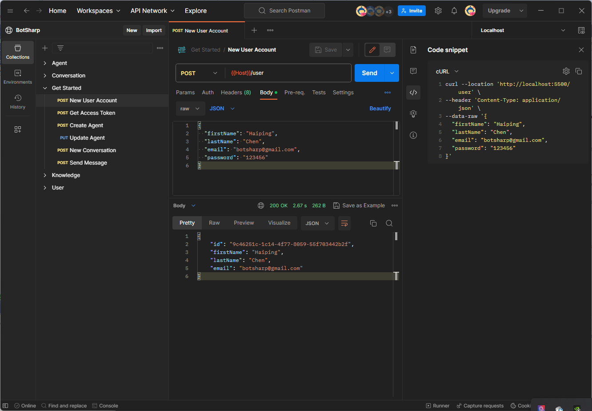
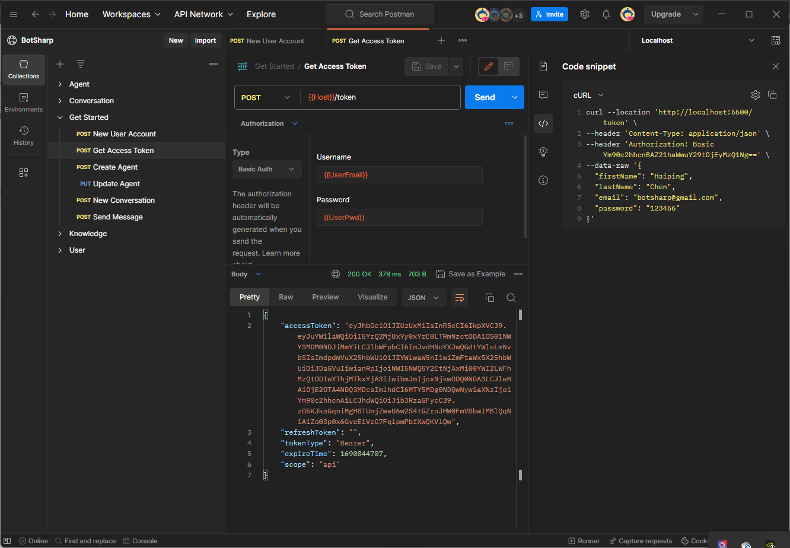

# 认证

## 用户账户
作为一个机器人构建框架，最基本的一步是集成用户认证功能，以便后端 API 能够识别当前请求来自哪个用户。这样可以进一步构建一个更完整的业务系统。BotSharp 可以与 ASP.NET MVC 的用户认证功能结合使用。

### 创建用户账户
使用 BotSharp 中的 [账户创建](https://www.postman.com/orange-flare-634868/workspace/botsharp/request/1346299-1b868c08-c6ac-48a5-94ab-93f6f080c085) API 创建第一个平台用户。

## 获取访问令牌
平台用户创建后，可以通过 [获取令牌](https://www.postman.com/orange-flare-634868/workspace/botsharp/request/1346299-5d70fec4-dfa0-4b74-a4fd-8cd21009d44f) API 获取用户令牌，所有后续的 API 都需要此令牌。

