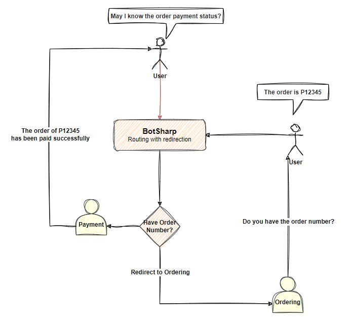
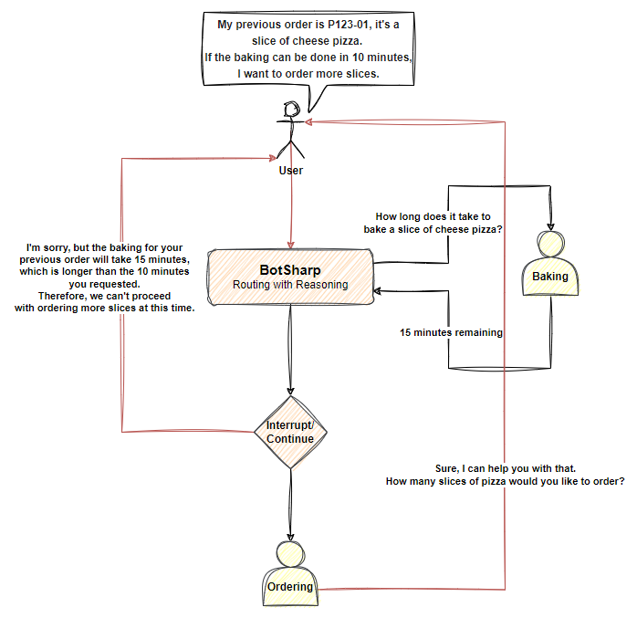

# 路由

路由是一个重要的功能，它允许多个代理协同工作以完成企业级任务。当你将 LLM 应用于业务系统时，不可避免地要开发具有不同功能的代理。如何有效管理如此多职责不同的代理是一个具有挑战性的任务。从工程角度来看，不同的团队负责开发不同的代理，团队之间将面临代理相互隔离的问题。理想的情况是它们可以独立开发但相互合作。

## 路由器

路由功能是 BotSharp 用于管理多个代理的核心技术。BotSharp 内置了一个名为 `Router` 的智能代理。当你启用此功能时，所有用户请求将由路由器预处理，以确定将请求分配给哪个代理进行处理。路由技术的优势在于它可以隔离不同的代理，并使它们协同工作以实现用户的目标。采用 `Routing` 确保代理在企业应用中具有可扩展性、灵活性和足够的鲁棒性。

## 推理器

对于用户提出的简单问题，普通的路由功能已经可以处理。然而，对于用户有长描述且需要拆解任务的场景，普通路由无法处理。这时需要开启 `Reasoning` 功能，LLM 将根据问题的复杂性将其分解为不同的小任务。这些小任务可以由相应的代理处理。在处理过程中，路由器会不断调整下一步计划，以应对代理返回的不同结果。

有关更多 **Routing** 相关信息，请访问 [Agent Routing](../agent/router.md)。

## 配置文件

在代理数据模型中有一个名为 `Profile` 的数组字段，用于存储当前的配置文件。当在 `Router` 中设置此属性时，只有匹配的任务代理才能包含在路由候选代理列表中，这意味着任务代理也需要设置相同的配置文件名称。配置文件允许你输入多个配置文件，系统会自动将它们组合进行处理。