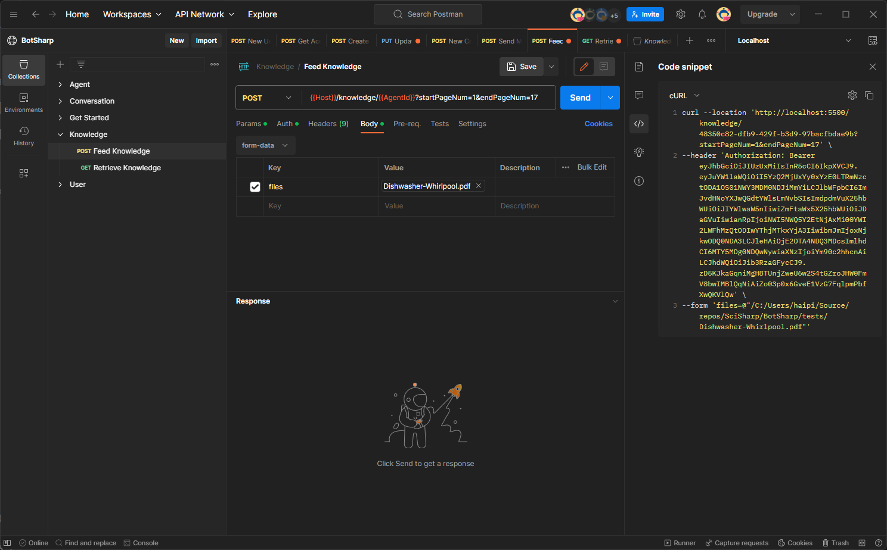
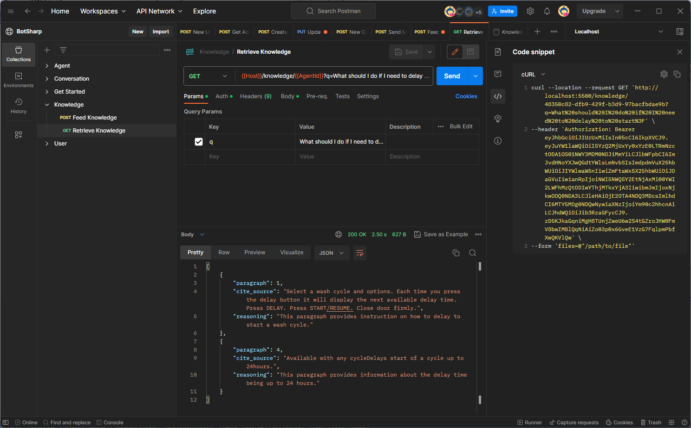

# 构建问答机器人

## 提供知识

使用提供知识接口将知识输入到数据库中。在此之前，您需要创建一个 Agent 来管理 Chatbot，并且在后续操作中需要使用 Agent 的 `id`。
`http://localhost:5500/knowledge/{agentId}`，您可以添加 `startPageNum` 和 `endPageNum` 来选择文档的有用部分。

## 检索知识

在输入完知识后，您可以开始使用您的 AI 助手提问相关问题。

