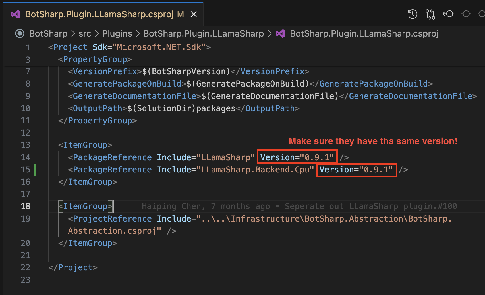

# 配置 LLamaSharp

BotSharp 包含 LLamaSharp 插件，允许您运行本地 LLM 模型。要使用 LLamaSharp，您需要按几个步骤配置 BotSharp 项目。

## 安装 LLamaSharp 后端

在使用 LLamaSharp 插件之前，您需要安装适合您环境的 LLamaSharp 后端服务之一。

- [`LLamaSharp.Backend.Cpu`](https://www.nuget.org/packages/LLamaSharp.Backend.Cpu): 纯 CPU 适用于 Windows 和 Linux。Metal 适用于 Mac。
- [`LLamaSharp.Backend.Cuda11`](https://www.nuget.org/packages/LLamaSharp.Backend.Cuda11): 适用于 Windows 和 Linux 的 CUDA 11
- [`LLamaSharp.Backend.Cuda12`](https://www.nuget.org/packages/LLamaSharp.Backend.Cuda12): 适用于 Windows 和 Linux 的 CUDA 12

**请安装与 BotSharp.Plugin.LLamaSharp.csproj 中 LLamaSharp 相同版本的 LLamaSharp 后端。**



```shell
# 移动到 LLamaSharp 插件项目
$ cd src/Plugins/BotSharp.Plugin.LLamaSharp
# 安装 LLamaSharp 后端
$ dotnet add package LLamaSharp.Backend.Cpu --version 0.9.1
```

## 下载和配置本地 LLM 模型

LLamaSharp 支持许多 LLM 模型，如 LLaMA 和 Alpaca。下载 `gguf` 格式的模型并将其保存在您的计算机中。

在本教程中，我们将使用 [Llama 2](https://huggingface.co/TheBloke/llama-2-7B-Guanaco-QLoRA-GGUF) 模型。

下载模型后，打开 `src/WebStarter/appsettings.json` 文件以配置 LLamaSharp 模型。根据您的计算机设置 `LlmProviders` 和 `LlamaSharp` 字段。例如：

```json
{
    ...,
    "LlmProviders": [
        ...,
        {
            "Provider": "llama-sharp",
            "Models": [
                {
                "Name": "llama-2-7b.Q2_K.gguf",
                "Type": "chat"
                }
            ]
        },
        ...
    ],
    ...,
    "LlamaSharp": {
        "Interactive": true,
        "ModelDir": "/Users/wenwei/Desktop/LLM",
        "DefaultModel": "llama-2-7b.Q2_K.gguf",
        "MaxContextLength": 1024,
        "NumberOfGpuLayer": 20
    },
    ...
}
```

有关 LLamaSharp 的更多详细信息，请访问 [LLamaSharp - GitHub](https://github.com/SciSharp/LLamaSharp)。
