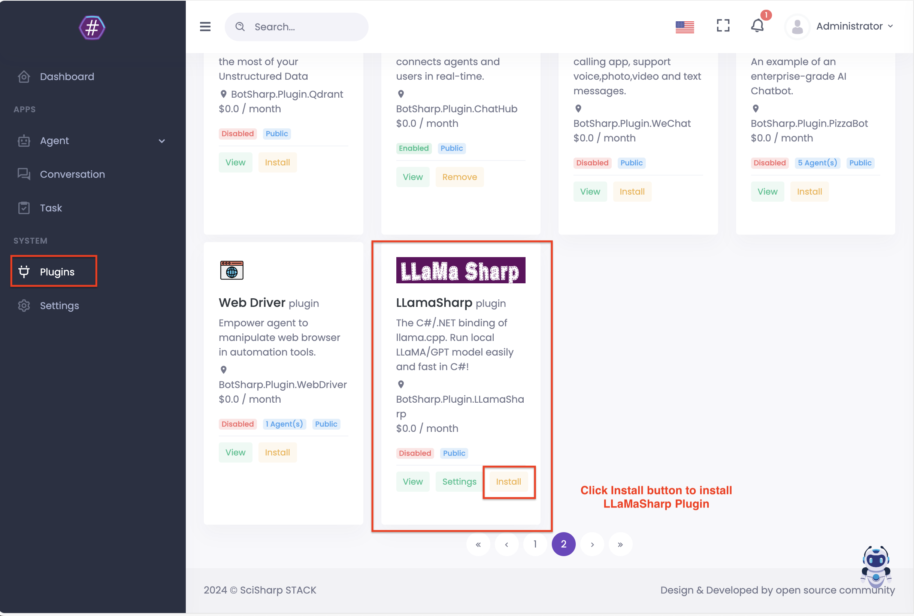
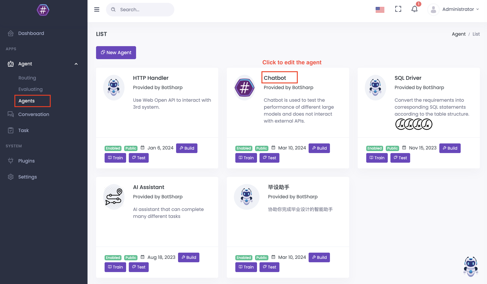
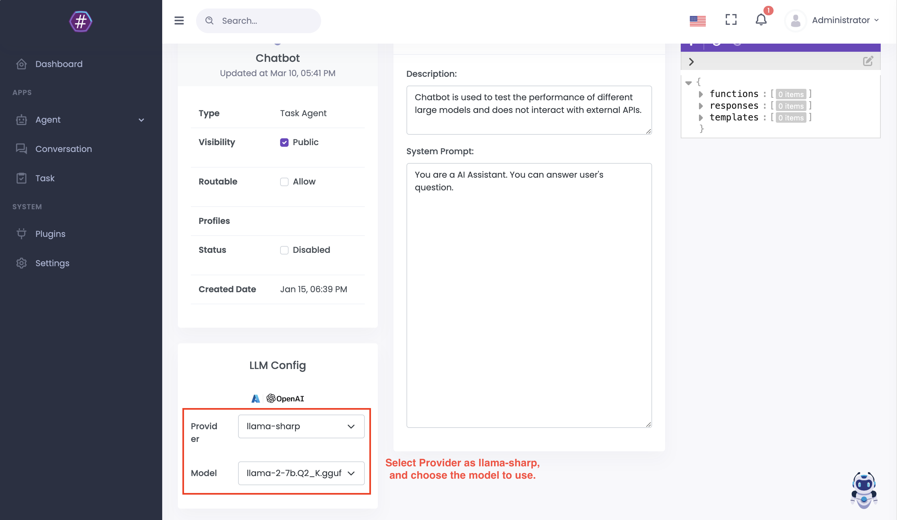
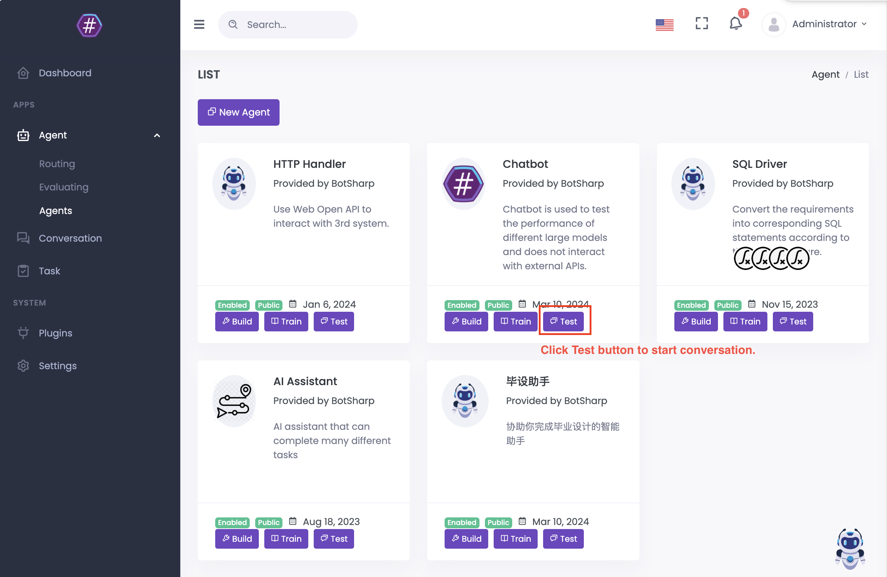
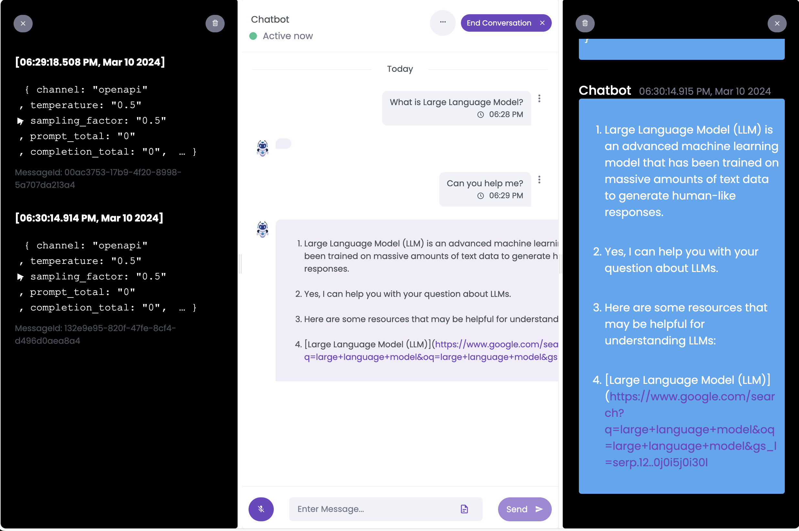
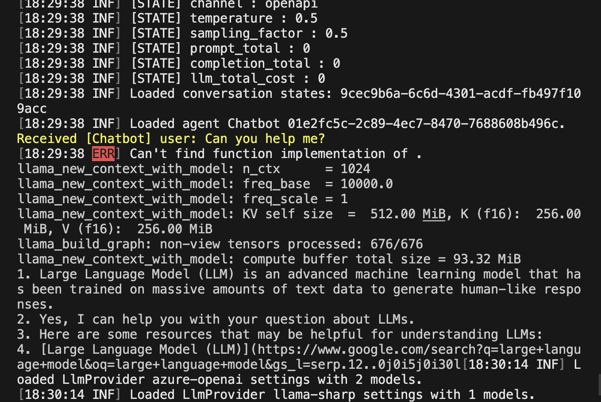

# 在 BotSharp 中使用 LLamaSharp

启动 BotSharp 后端和前端服务，并按照本教程进行操作。

## 在 UI 中安装 LLamaSharp 插件

进入插件页面并安装 LLamaSharp 插件。

## 配置 LLamaSharp 作为代理的 LLM 提供者

在代理页面编辑或创建一个代理，并配置该代理。

在编辑页面中，将提供者配置为 llama-sharp。

然后测试代理。

如果运行成功，您将在 BotSharp 服务的控制台中看到如下日志。

