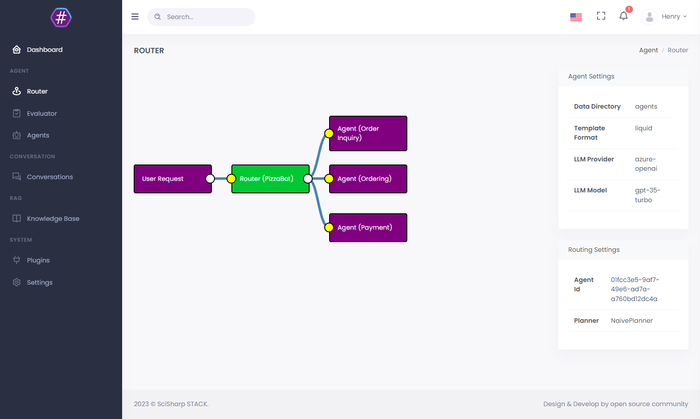

# 入门指南

### 开始使用 Pizza Bot

为了让开发者尽快体验到 BotSharp 的便利性，我们设计了一个基础示例项目 PizzaBot。这个示例允许你在本地机器上快速运行。如果你想在本地运行此示例，需要下载 `llama-2` 量化模型并使用 `gguf` 格式。

### 在命令行中运行

```shell
git clone https://github.com/SciSharp/BotSharp
cd BotSharp
# 使用包引用运行 PizzaBot 示例
dotnet run --project .\src\WebStarter\WebStarter.csproj -p SolutionName=PizzaBot

# 使用 BotSharp 包含所有依赖项目的最新源代码
dotnet run --project .\src\WebStarter\WebStarter.csproj -p SolutionName=BotSharp
```

运行后，你将看到如下运行界面。


接下来，尝试从 `Open API` 访问聊天功能，我们公开了 [Postman 集合](https://www.postman.com/orange-flare-634868/workspace/botsharp/collection/1346299-d1a31c49-825d-4449-bdc8-936c66ff6bfd)。记得将环境设置为 `localhost`。


### 启动 UI

BotSharp 有一个官方前端项目，可以与后端配合使用。该项目的主要功能是让开发者可视化后端的各种配置。

```console
git clone https://github.com/SciSharp/BotSharp-UI
cd BotSharp-UI
npm install
npm run dev
```

访问 http://localhost:5015/



### 以调试模式运行

如果你安装了 Visual Studio，可以以调试模式运行。
双击 `PizzaBot` 启动解决方案。


点击 `WebStarter` 以调试模式运行，或者你也可以从命令行启动

