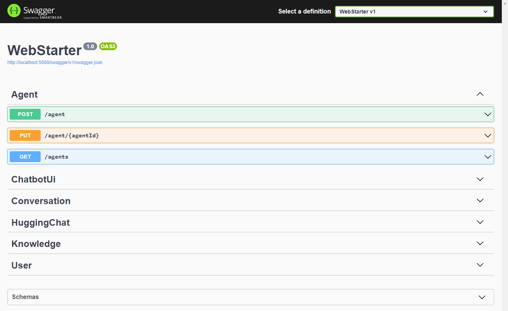

# 安装

BotSharp 严格遵循模块化设计原则，采用视图和逻辑分离的结构。它还提供了完整的 Web API 接口，以便与您自己的系统集成。在架构层面，Hook 和 Event 被设计用于不同的目的，可以在不更改内核的情况下扩展 Chatbot 的对话能力。

## 在开发模式下本地运行

如果您是 .NET 开发人员并希望开发扩展或修复 BotSharp 的错误，您可以按 F5 在调试模式下本地运行它。
确保安装 [Microsoft .NET SDK](https://dotnet.microsoft.com/en-us/download/dotnet/6.0) 6.0+ 构建环境
使用 dotnet CLI 构建解决方案（首选）。

### 克隆源代码并构建
```powershell
PS D:\> git clone https://github.com/SciSharp/BotSharp
PS D:\> cd BotSharp
PS D:\> dotnet build
```

### 更新配置
`BotSharp` 可以与多个 LLM 提供商一起工作。在您的项目中更新 `appsettings.json`。以下配置是将 Azure OpenAI 作为 LLM 后端

```json
"LlmProviders": [
  {
    "Provider": "azure-openai",
    "Models": [
      {
        "Name": "gpt-35-turbo",
        "ApiKey": "",
        "Endpoint": "https://gpt-35-turbo.openai.azure.com/",
        "Type": "chat",
        "PromptCost": 0.0015,
        "CompletionCost": 0.002
      },
      {
        "Name": "gpt-35-turbo-instruct",
        "ApiKey": "",
        "Endpoint": "https://gpt-35-turbo-instruct.openai.azure.com/",
        "Type": "text",
        "PromptCost": 0.0015,
        "CompletionCost": 0.002
      }
    ]
  }
]
```

### 运行后端 Web 项目
```powershell
PS D:\> dotnet run --project src/WebStarter
```


### 打开 REST APIs
您可以通过浏览器访问 http://localhost:5500/swagger 中的 API


### 使用 Postman 测试
我们公开分享了 [Postman](https://www.postman.com/orange-flare-634868/workspace/botsharp/overview) 的 API 集合，方便开发人员快速开发。


到目前为止，您已经设置了 Bot 的运行和开发环境，但实际上还不能测试 Chatbot。下一步是关于如何 [创建代理](../agent/account) 并开始与 Chatbot 对话。

**如果您只打算使用 REST API 与您的机器人交互，请忽略以下部分。**

### 启动 BotSharp UI（可选）
BotSharp 有一个官方前端项目，可与后端配合使用。该项目的主要功能是允许开发人员可视化后端的各种配置。
```powershell
PS D:\> git clone https://github.com/SciSharp/BotSharp-UI
PS D:\> cd BotSharp-UI
PS D:\> npm install
PS D:\> npm run dev
```

在 `.env` 中更新 API URL 为您的本地 BotSharp 后端服务。
```config
PUBLIC_SERVICE_URL=http://localhost:5500
PUBLIC_LIVECHAT_HOST=http://localhost:5015
```

在浏览器中访问 http://localhost:5015 并享受与 BotSharp 的 Chatbot 互动。


## 在 NuGet 中安装
如果您不想使用源代码来体验此框架，您也可以直接安装 BotSharp 发布的 [NuGet 包](https://www.nuget.org/packages?q=BotSharp)，并根据项目需求安装不同的功能包。在安装之前，请仔细阅读文档以了解不同模块可以提供的功能。

```powershell
PS D:\> Install-Package BotSharp.Core
```
